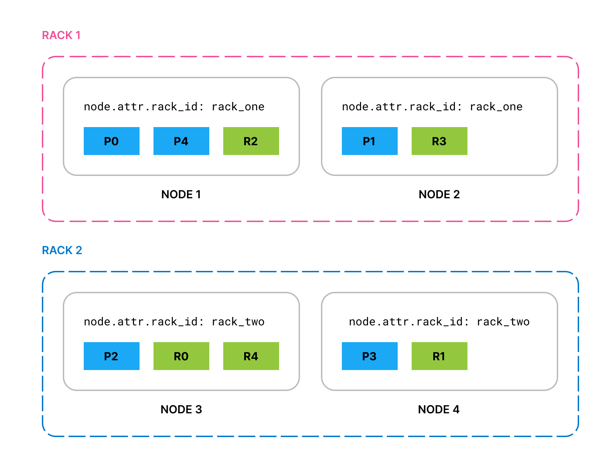

[TOC]

---

# [Cluster-level shard allocation and routing settings | 集群级分片分配和路由设置](https://www.elastic.co/guide/en/elasticsearch/reference/current/modules-cluster.html)

Shard allocation is the process of assigning shard copies to nodes. This can happen during initial recovery, replica allocation, rebalancing, when nodes are added to or removed from the cluster, or when cluster or index settings that impact allocation are updated.
分片分配是将分片副本分配给节点的过程。这可能发生在初始恢复、副本分配、重新平衡期间、在集群中添加或删除节点时，或者在更新影响分配的集群或索引设置时。

One of the main roles of the master is to decide which shards to allocate to which nodes, and when to move shards between nodes in order to rebalance the cluster.
主服务器的主要角色之一是决定将哪些分片分配给哪些节点，以及何时在节点之间移动分片以重新平衡集群。

There are a number of settings available to control the shard allocation process:
有许多设置可用于控制分片分配过程：

- [Cluster-level shard allocation settings](https://www.elastic.co/guide/en/elasticsearch/reference/current/modules-cluster.html#cluster-shard-allocation-settings) control allocation and rebalancing operations.
  [集群级分片分配设置](https://www.elastic.co/guide/en/elasticsearch/reference/current/modules-cluster.html#cluster-shard-allocation-settings)控制分配和重新平衡操作。
- [Disk-based shard allocation settings](https://www.elastic.co/guide/en/elasticsearch/reference/current/modules-cluster.html#disk-based-shard-allocation) explains how Elasticsearch takes available disk space into account, and the related settings.
  [基于磁盘的分片分配设置](https://www.elastic.co/guide/en/elasticsearch/reference/current/modules-cluster.html#disk-based-shard-allocation) 介绍了 Elasticsearch 如何考虑可用磁盘空间以及相关设置。
- [Shard allocation awareness](https://www.elastic.co/guide/en/elasticsearch/reference/current/modules-cluster.html#shard-allocation-awareness) and [Forced awareness](https://www.elastic.co/guide/en/elasticsearch/reference/current/modules-cluster.html#forced-awareness) control how shards can be distributed across different racks or availability zones.
  [分片分配感知](https://www.elastic.co/guide/en/elasticsearch/reference/current/modules-cluster.html#shard-allocation-awareness)和[强制感知](https://www.elastic.co/guide/en/elasticsearch/reference/current/modules-cluster.html#forced-awareness)控制分片如何分布在不同的机架或可用区域。
- [Cluster-level shard allocation filtering](https://www.elastic.co/guide/en/elasticsearch/reference/current/modules-cluster.html#cluster-shard-allocation-filtering) allows certain nodes or groups of nodes excluded from allocation so that they can be decommissioned.
  [集群级分片分配过滤](https://www.elastic.co/guide/en/elasticsearch/reference/current/modules-cluster.html#cluster-shard-allocation-filtering) 允许将某些节点或节点组排除在分配之外，以便可以将其退役。

Besides these, there are a few other [miscellaneous cluster-level settings](https://www.elastic.co/guide/en/elasticsearch/reference/current/misc-cluster-settings.html).
除此之外，还有一些其他[杂项集群级别设置]（https://www.elastic.co/guide/en/elasticsearch/reference/current/misc-cluster-settings.html）。

---

# [Cluster-level shard allocation settings | 集群级分片分配设置](https://www.elastic.co/guide/en/elasticsearch/reference/current/modules-cluster.html#cluster-shard-allocation-settings)

You can use the following settings to control shard allocation and recovery:
您可以使用以下设置来控制分片分配和恢复：

- **`cluster.routing.allocation.enable`**
  (Dynamic) Enable or disable allocation for specific kinds of shards:
  （动态）启用或禁用特定类型的分片的分配：
  - `all` - (default) Allows shard allocation for all kinds of shards.
    `all` - （默认）允许为所有类型的分片分配分片。
  - `primaries` - Allows shard allocation only for primary shards.
    `primaries` - 仅允许为主分片分配分片。
  - `new_primaries` - Allows shard allocation only for primary shards for new indices.
    `new_primaries` - 仅允许为新索引的主分片分配分片。
  - `none` - No shard allocations of any kind are allowed for any indices.
    `none` — 不允许对任何索引进行任何类型的分片分配。

  This setting only affects future allocations, and does not re-allocate or un-allocate currently allocated shards. It also does not affect the recovery of local primary shards when restarting a node. A restarted node that has a copy of an unassigned primary shard will recover that primary immediately, assuming that its allocation id matches one of the active allocation ids in the cluster state.
  此设置仅影响未来的分配，不会重新分配或取消分配当前已分配的分片。它也不会影响重新启动节点时本地主分片的恢复。重新启动的节点如果拥有未分配主分片的副本，则会立即恢复该主分片，前提是其分配 ID 与集群状态中的某个活动分配 ID 匹配。
- **`cluster.routing.allocation.same_shard.host`**
  ([Dynamic](https://www.elastic.co/guide/en/elasticsearch/reference/current/settings.html#dynamic-cluster-setting)) If `true`, forbids multiple copies of a shard from being allocated to distinct nodes on the same host, i.e. which have the same network address. Defaults to `false`, meaning that copies of a shard may sometimes be allocated to nodes on the same host. This setting is only relevant if you run multiple nodes on each host.
  （[动态](https://www.elastic.co/guide/en/elasticsearch/reference/current/settings.html#dynamic-cluster-setting)）如果为`true`，则禁止将分片的多个副本分配到同一主机上的不同节点，即具有相同网络地址的节点。默认为`false`，这意味着分片的副本有时可能会分配到同一主机上的节点。此设置仅在您在每个主机上运行多个节点时才有意义。
- **`cluster.routing.allocation.node_concurrent_incoming_recoveries`**
  ([Dynamic](https://www.elastic.co/guide/en/elasticsearch/reference/current/settings.html#dynamic-cluster-setting)) How many concurrent incoming shard recoveries are allowed to happen on a node. Incoming recoveries are the recoveries where the target shard (most likely the replica unless a shard is relocating) is allocated on the node. Defaults to `2`. Increasing this setting may cause shard movements to have a performance impact on other activity in your cluster, but may not make shard movements complete noticeably sooner. We do not recommend adjusting this setting from its default of `2`.
  （[Dynamic](https://www.elastic.co/guide/en/elasticsearch/reference/current/settings.html#dynamic-cluster-setting)）允许在节点上进行多少次并发传入分片恢复。传入恢复是目标分片（除非分片正在重新定位，否则很可能是副本）在节点上分配的恢复。默认值为 `2`。增加此设置可能会导致分片移动对集群中的其他活动产生性能影响，但可能不会使分片移动明显更快地完成。我们不建议调整此设置的默认值 `2`。
- **`cluster.routing.allocation.node_concurrent_outgoing_recoveries`**
  ([Dynamic](https://www.elastic.co/guide/en/elasticsearch/reference/current/settings.html#dynamic-cluster-setting)) How many concurrent outgoing shard recoveries are allowed to happen on a node. Outgoing recoveries are the recoveries where the source shard (most likely the primary unless a shard is relocating) is allocated on the node. Defaults to `2`. Increasing this setting may cause shard movements to have a performance impact on other activity in your cluster, but may not make shard movements complete noticeably sooner. We do not recommend adjusting this setting from its default of `2`.
  （[Dynamic](https://www.elastic.co/guide/en/elasticsearch/reference/current/settings.html#dynamic-cluster-setting)）允许在节点上进行多少次并发传出分片恢复。传出恢复是源分片（除非分片正在重新定位，否则很可能是主分片）在节点上分配的恢复。默认值为 `2`。增加此设置可能会导致分片移动对集群中的其他活动产生性能影响，但可能不会使分片移动明显更快地完成。我们不建议调整此设置的默认值 `2`。
- **`cluster.routing.allocation.node_concurrent_recoveries`**
  ([Dynamic](https://www.elastic.co/guide/en/elasticsearch/reference/current/settings.html#dynamic-cluster-setting)) A shortcut to set both `cluster.routing.allocation.node_concurrent_incoming_recoveries` and `cluster.routing.allocation`.node_concurrent_outgoing_recoveries. The value of this setting takes effect only when the more specific setting is not configured. Defaults to `2`. Increasing this setting may cause shard movements to have a performance impact on other activity in your cluster, but may not make shard movements complete noticeably sooner. We do not recommend adjusting this setting from its default of `2`.
  （[Dynamic](https://www.elastic.co/guide/en/elasticsearch/reference/current/settings.html#dynamic-cluster-setting)）设置 `cluster.routing.allocation.node_concurrent_incoming_recoveries` 和 `cluster.routing.allocation`.node_concurrent_outgoing_recoveries 的快捷方式。此设置的值仅在未配置更具体的设置时生效。默认为 `2`。增加此设置可能会导致分片移动对集群中的其他活动产生性能影响，但可能不会使分片移动明显更快地完成。我们不建议调整此设置的默认值 `2`。
- **`cluster.routing.allocation.node_initial_primaries_recoveries`**
  ([Dynamic](https://www.elastic.co/guide/en/elasticsearch/reference/current/settings.html#dynamic-cluster-setting)) While the recovery of replicas happens over the network, the recovery of an unassigned primary after node restart uses data from the local disk. These should be fast so more initial primary recoveries can happen in parallel on each node. Defaults to `4`. Increasing this setting may cause shard recoveries to have a performance impact on other activity in your cluster, but may not make shard recoveries complete noticeably sooner. We do not recommend adjusting this setting from its default of `4`.


---

# [Shard rebalancing settings | 分片重新平衡设置](https://www.elastic.co/guide/en/elasticsearch/reference/current/modules-cluster.html#shards-rebalancing-settings)

A cluster is *balanced* when it has an equal number of shards on each node, with all nodes needing equal resources, without having a concentration of shards from any index on any node. Elasticsearch runs an automatic process called *rebalancing* which moves shards between the nodes in your cluster to improve its balance. Rebalancing obeys all other shard allocation rules such as [allocation filtering](https://www.elastic.co/guide/en/elasticsearch/reference/current/modules-cluster.html#cluster-shard-allocation-filtering) and [forced awareness](https://www.elastic.co/guide/en/elasticsearch/reference/current/modules-cluster.html#forced-awareness) which may prevent it from completely balancing the cluster. In that case, rebalancing strives to achieve the most balanced cluster possible within the rules you have configured. If you are using [data tiers](https://www.elastic.co/guide/en/elasticsearch/reference/current/data-tiers.html) then Elasticsearch automatically applies allocation filtering rules to place each shard within the appropriate tier. These rules mean that the balancer works independently within each tier.
如果集群在每个节点上具有相同数量的分片，并且所有节点都需要相同的资源，而任何索引的分片不会集中在任何节点上，则集群是*平衡的*。Elasticsearch 会运行一个名为*重新平衡*的自动过程，该过程会在集群中的节点之间移动分片以改善其平衡性。重新平衡遵循所有其他分片分配规则，例如[分配过滤](https://www.elastic.co/guide/en/elasticsearch/reference/current/modules-cluster.html#cluster-shard-allocation-filtering)和[强制感知](https://www.elastic.co/guide/en/elasticsearch/reference/current/modules-cluster.html#forced-awareness)，这些规则可能会阻止它完全平衡集群。在这种情况下，重新平衡会努力在您配置的规则内实现最平衡的集群。如果您使用 [数据层](https://www.elastic.co/guide/en/elasticsearch/reference/current/data-tiers.html)，则 Elasticsearch 会自动应用分配过滤规则，将每个分片放置在适当的层内。这些规则意味着平衡器在每个层内独立工作。

You can use the following settings to control the rebalancing of shards across the cluster:
您可以使用以下设置来控制整个集群中分片的重新平衡：

- **`cluster.routing.allocation.allow_rebalance`**
  ([Dynamic](https://www.elastic.co/guide/en/elasticsearch/reference/current/settings.html#dynamic-cluster-setting)) Specify when shard rebalancing is allowed:
  （[Dynamic](https://www.elastic.co/guide/en/elasticsearch/reference/current/settings.html#dynamic-cluster-setting)）指定何时允许分片重新平衡：
  - `always` - (default) Always allow rebalancing.
    `always` - （默认）始终允许重新平衡。
  - `indices_primaries_active` - Only when all primaries in the cluster are allocated.
    `indices_primaries_active` - 仅当集群中的所有主节点都已分配时。
  - `indices_all_active` - Only when all shards (primaries and replicas) in the cluster are allocated.
    `indices_all_active` - 仅当集群中的所有分片（主节点和副本）都已分配时。
- **`cluster.routing.rebalance.enable`**
  ([Dynamic](https://www.elastic.co/guide/en/elasticsearch/reference/current/settings.html#dynamic-cluster-setting)) Enable or disable rebalancing for specific kinds of shards:
  （[Dynamic](https://www.elastic.co/guide/en/elasticsearch/reference/current/settings.html#dynamic-cluster-setting)）启用或禁用特定类型分片的重新平衡：
  - `all` - (default) Allows shard balancing for all kinds of shards.
    `all`-（默认）允许对所有类型的分片进行分片平衡。
  - `primaries` - Allows shard balancing only for primary shards.
    `primaries`——仅允许对主分片进行分片平衡。
  - `replicas` - Allows shard balancing only for replica shards.
    `replicas` - 仅允许对副本分片进行分片平衡。
  - `none` - No shard balancing of any kind are allowed for any indices.
    `none` — 不允许任何索引进行任何类型的分片平衡。
  
  Rebalancing is important to ensure the cluster returns to a healthy and fully resilient state after a disruption. If you adjust this setting, remember to set it back to `all` as soon as possible.
  重新平衡对于确保集群在中断后恢复到健康且完全有弹性的状态非常重要。如果您调整此设置，请记住尽快将其重新设置为`all`。
- **`cluster.routing.allocation.cluster_concurrent_rebalance`**
  ([Dynamic](https://www.elastic.co/guide/en/elasticsearch/reference/current/settings.html#dynamic-cluster-setting)) Defines the number of concurrent shard rebalances are allowed across the whole cluster. Defaults to `2`. Note that this setting only controls the number of concurrent shard relocations due to imbalances in the cluster. This setting does not limit shard relocations due to [allocation filtering](https://www.elastic.co/guide/en/elasticsearch/reference/current/modules-cluster.html#cluster-shard-allocation-filtering) or [forced awareness](https://www.elastic.co/guide/en/elasticsearch/reference/current/modules-cluster.html#forced-awareness). Increasing this setting may cause the cluster to use additional resources moving shards between nodes, so we generally do not recommend adjusting this setting from its default of `2`.
  （[Dynamic](https://www.elastic.co/guide/en/elasticsearch/reference/current/settings.html#dynamic-cluster-setting)）定义整个集群中允许的并发分片重新平衡数量。默认值为 `2`。请注意，此设置仅控制由于集群不平衡而导致的并发分片重定位数量。此设置不会限制由于 [分配过滤](https://www.elastic.co/guide/en/elasticsearch/reference/current/modules-cluster.html#cluster-shard-allocation-filtering) 或 [强制感知](https://www.elastic.co/guide/en/elasticsearch/reference/current/modules-cluster.html#forced-awareness) 而导致的分片重定位。增加此设置可能会导致集群使用额外的资源在节点之间移动分片，因此我们通常不建议调整此设置的默认值 `2`。
- **`cluster.routing.allocation.type`**
  Selects the algorithm used for computing the cluster balance. Defaults to `desired_balance` which selects the desired *balance allocator*. This allocator runs a background task which computes the desired balance of shards in the cluster. Once this background task completes, Elasticsearch moves shards to their desired locations.
  选择用于计算集群平衡的算法。默认为`desired_balance`，选择所需的`平衡分配器`。此分配器运行后台任务，计算集群中所需的分片平衡。此后台任务完成后，Elasticsearch 会将分片移动到所需位置。

  [~~8.8~~](Deprecated in 8.8. The `balanced` allocator type is deprecated and no longer recommended)May also be set to `balanced` to select the legacy balanced allocator. This allocator was the default allocator in versions of Elasticsearch before 8.6.0. It runs in the foreground, preventing the master from doing other work in parallel. It works by selecting a small number of shard movements which immediately improve the balance of the cluster, and when those shard movements complete it runs again and selects another few shards to move. Since this allocator makes its decisions based only on the current state of the cluster, it will sometimes move a shard several times while balancing the cluster.
  [~~8.8~~]（在 8.8 中已弃用。`balanced` 分配器类型已弃用，不再推荐使用）也可以设置为 `balanced` 以选择传统的平衡分配器。此分配器是 8.6.0 之前版本的 Elasticsearch 中的默认分配器。它在前台运行，防止主服务器并行执行其他工作。它的工作原理是选择少量可立即改善集群平衡的分片移动，当这些分片移动完成后，它会再次运行并选择另外几个分片进行移动。由于此分配器仅根据集群的当前状态做出决策，因此它有时会在平衡集群时多次移动分片。


---

# [Shard balancing heuristics settings | 分片平衡启发式设置](https://www.elastic.co/guide/en/elasticsearch/reference/current/modules-cluster.html#shards-rebalancing-heuristics)

Rebalancing works by computing a `weight` for each node based on its allocation of shards, and then moving shards between nodes to reduce the weight of the heavier nodes and increase the weight of the lighter ones. The cluster is balanced when there is no possible shard movement that can bring the weight of any node closer to the weight of any other node by more than a configurable threshold.
重新平衡的工作原理是，根据每个节点的分片分配情况计算其`权重`，然后在节点之间移动分片，以减少较重节点的权重并增加较轻节点的权重。当没有可能的分片移动使任何节点的权重更接近任何其他节点的权重（且相差不超过可配置的阈值）时，集群就处于平衡状态。

The weight of a node depends on the number of shards it holds and on the total estimated resource usage of those shards expressed in terms of the size of the shard on disk and the number of threads needed to support write traffic to the shard. Elasticsearch estimates the resource usage of shards belonging to data streams when they are created by a rollover. The estimated disk size of the new shard is the mean size of the other shards in the data stream. The estimated write load of the new shard is a weighted average of the actual write loads of recent shards in the data stream. Shards that do not belong to the write index of a data stream have an estimated write load of zero.
节点的权重取决于它所持有的分片数量以及这些分片的估计总资源使用量，以磁盘上的分片大小和支持分片写入流量所需的线程数来表示。Elasticsearch 在通过轮转创建属于数据流的分片时会估计其资源使用量。新分片的估计磁盘大小是数据流中其他分片的平均大小。新分片的估计写入负载是数据流中最近分片的实际写入负载的加权平均值。不属于数据流写入索引的分片的估计写入负载为零。

The following settings control how Elasticsearch combines these values into an overall measure of each node’s weight.
以下设置控制 Elasticsearch 如何将这些值组合成每个节点权重的总体测量。
- `cluster.routing.allocation.balance.threshold`
  (float, [Dynamic](https://www.elastic.co/guide/en/elasticsearch/reference/current/settings.html#dynamic-cluster-setting)) The minimum improvement in weight which triggers a rebalancing shard movement. Defaults to `1.0f`. Raising this value will cause Elasticsearch to stop rebalancing shards sooner, leaving the cluster in a more unbalanced state.
（浮点数，[动态](https://www.elastic.co/guide/en/elasticsearch/reference/current/settings.html#dynamic-cluster-setting)）触发重新平衡分片移动的权重最小改进值。默认值为 `1.0f`。增加此值将导致 Elasticsearch 更快地停止重新平衡分片，从而使集群处于更不平衡的状态。
- `cluster.routing.allocation.balance.shard`
  (float, [Dynamic](https://www.elastic.co/guide/en/elasticsearch/reference/current/settings.html#dynamic-cluster-setting)) Defines the weight factor for the total number of shards allocated to each node. Defaults to `0.45f`. Raising this value increases the tendency of Elasticsearch to equalize the total number of shards across nodes ahead of the other balancing variables.
  （浮点型，[动态](https://www.elastic.co/guide/en/elasticsearch/reference/current/settings.html#dynamic-cluster-setting)）定义分配给每个节点的分片总数的权重因子。默认值为 0.45f。增加此值会增加 Elasticsearch 在其他平衡变量之前均衡节点间分片总数的趋势。
- `cluster.routing.allocation.balance.index`
  (float, [Dynamic](https://www.elastic.co/guide/en/elasticsearch/reference/current/settings.html#dynamic-cluster-setting)) Defines the weight factor for the number of shards per index allocated to each node. Defaults to [0.55f]. Raising this value increases the tendency of Elasticsearch to equalize the number of shards of each index across nodes ahead of the other balancing variables.
  （浮点数，[动态](https://www.elastic.co/guide/en/elasticsearch/reference/current/settings.html#dynamic-cluster-setting)）定义分配给每个节点的每个索引的分片数量的权重因子。默认值为 [0.55f]。增加此值会增加 Elasticsearch 在其他平衡变量之前均衡节点间每个索引的分片数量的趋势。
- `cluster.routing.allocation.balance.disk_usage`
  (float, [Dynamic](https://www.elastic.co/guide/en/elasticsearch/reference/current/settings.html#dynamic-cluster-setting)) Defines the weight factor for balancing shards according to their predicted disk size in bytes. Defaults to `2e-11f`. Raising this value increases the tendency of Elasticsearch to equalize the total disk usage across nodes ahead of the other balancing variables.
  （浮点型，[动态](https://www.elastic.co/guide/en/elasticsearch/reference/current/settings.html#dynamic-cluster-setting)）根据预测的磁盘大小（以字节为单位）定义分片平衡的权重因子。默认值为 2e-11f。增加此值会增加 Elasticsearch 在其他平衡变量之前均衡节点间总磁盘使用量的趋势。
- `cluster.routing.allocation.balance.write_load`
  (float, [Dynamic](https://www.elastic.co/guide/en/elasticsearch/reference/current/settings.html#dynamic-cluster-setting)) Defines the weight factor for the write load of each shard, in terms of the estimated number of indexing threads needed by the shard. Defaults to `10.0f`. Raising this value increases the tendency of Elasticsearch to equalize the total write load across nodes ahead of the other balancing variables.
  （浮点型，[动态](https://www.elastic.co/guide/en/elasticsearch/reference/current/settings.html#dynamic-cluster-setting)）根据分片所需的索引线程估计数量，定义每个分片写入负载的权重因子。默认值为 `10.0f`。增加此值会增加 Elasticsearch 在其他平衡变量之前均衡节点间总写入负载的趋势。

> **NOTE**
> - If you have a large cluster, it may be unnecessary to keep it in a perfectly balanced state at all times. It is less resource-intensive for the cluster to operate in a somewhat unbalanced state rather than to perform all the shard movements needed to achieve the perfect balance. If so, increase the value of `cluster.routing.allocation.balance.threshold` to define the acceptable imbalance between nodes. For instance, if you have an average of 500 shards per node and can accept a difference of 5% (25 typical shards) between nodes, set `cluster.routing.allocation.balance.threshold` to `25`.
> 如果您拥有一个大型集群，则可能没有必要始终保持其处于完美平衡状态。集群在略微不平衡的状态下运行比执行实现完美平衡所需的所有分片移动更节省资源。如果是这样，请增加`cluster.routing.allocation.balance.threshold`的值以定义节点之间可接受的不平衡。例如，如果您每个节点平均有 500 个分片，并且可以接受节点之间 5%（25 个典型分片）的差异，请将`cluster.routing.allocation.balance.threshold`设置为`25`。
> - We do not recommend adjusting the values of the heuristic weight factor settings. The default values work well in all reasonable clusters. Although different values may improve the current balance in some ways, it is possible that they will create unexpected problems in the future or prevent it from gracefully handling an unexpected disruption.
> 我们不建议调整启发式权重因子设置的值。默认值在所有合理的集群中都适用。虽然不同的值可能会在某些方面改善当前的平衡，但它们可能会在未来造成意外问题或阻止其妥善处理意外中断。
> - Regardless of the result of the balancing algorithm, rebalancing might not be allowed due to allocation rules such as forced awareness and allocation filtering. Use the [Cluster allocation explain](https://www.elastic.co/guide/en/elasticsearch/reference/current/cluster-allocation-explain.html) API to explain the current allocation of shards.
> 无论平衡算法的结果如何，由于强制感知和分配过滤等分配规则，可能不允许重新平衡。使用 [集群分配解释](https://www.elastic.co/guide/en/elasticsearch/reference/current/cluster-allocation-explain.html) API 来解释分片的当前分配。


---

# [Disk-based shard allocation settings | 基于磁盘的分片分配设置](https://www.elastic.co/guide/en/elasticsearch/reference/current/modules-cluster.html#disk-based-shard-allocation)

The disk-based shard allocator ensures that all nodes have enough disk space without performing more shard movements than necessary. It allocates shards based on a pair of thresholds known as the low watermark and the high watermark. Its primary goal is to ensure that no node exceeds the high watermark, or at least that any such overage is only temporary. If a node exceeds the high watermark then Elasticsearch will solve this by moving some of its shards onto other nodes in the cluster.
基于磁盘的分片分配器可确保所有节点都有足够的磁盘空间，而无需执行不必要的分片移动。它根据一对阈值（称为低水位线和高水位线）分配分片。其主要目标是确保没有节点超过高水位线，或者至少任何此类超额只是暂时的。如果某个节点超出了高水位线，那么 Elasticsearch 将通过将其部分分片移动到集群中的其他节点来解决这个问题。

> **NOTE**
> It is normal for nodes to temporarily exceed the high watermark from time to time.
> 节点偶尔暂时超过高水位是正常的。

The allocator also tries to keep nodes clear of the high watermark by forbidding the allocation of more shards to a node that exceeds the low watermark. Importantly, if all of your nodes have exceeded the low watermark then no new shards can be allocated and Elasticsearch will not be able to move any shards between nodes in order to keep the disk usage below the high watermark. You must ensure that your cluster has enough disk space in total and that there are always some nodes below the low watermark.
分配器还会尝试通过禁止向超过低水位线的节点分配更多分片来使节点远离高水位线。重要的是，如果您的所有节点都超过了低水位线，则无法分配任何新分片，并且 Elasticsearch 将无法在节点之间移动任何分片，以将磁盘使用率保持在高水位线以下。您必须确保您的集群总共有足够的磁盘空间，并且始终有一些节点低于低水位线。

Shard movements triggered by the disk-based shard allocator must also satisfy all other shard allocation rules such as [allocation filtering](https://www.elastic.co/guide/en/elasticsearch/reference/current/modules-cluster.html#cluster-shard-allocation-filtering) and [forced awareness](https://www.elastic.co/guide/en/elasticsearch/reference/current/modules-cluster.html#forced-awareness). If these rules are too strict then they can also prevent the shard movements needed to keep the nodes' disk usage under control. If you are using [data tiers](https://www.elastic.co/guide/en/elasticsearch/reference/current/data-tiers.html) then Elasticsearch automatically configures allocation filtering rules to place shards within the appropriate tier, which means that the disk-based shard allocator works independently within each tier.
基于磁盘的分片分配器触发的分片移动还必须满足所有其他分片分配规则，例如 [分配过滤](https://www.elastic.co/guide/en/elasticsearch/reference/current/modules-cluster.html#cluster-shard-allocation-filtering) 和 [强制感知](https://www.elastic.co/guide/en/elasticsearch/reference/current/modules-cluster.html#forced-awareness)。如果这些规则过于严格，那么它们还会阻止控制节点磁盘使用量所需的分片移动。如果您使用 [数据层](https://www.elastic.co/guide/en/elasticsearch/reference/current/data-tiers.html)，则 Elasticsearch 会自动配置分配过滤规则以将分片放置在适当的层内，这意味着基于磁盘的分片分配器在每个层内独立工作。

If a node is filling up its disk faster than Elasticsearch can move shards elsewhere then there is a risk that the disk will completely fill up. To prevent this, as a last resort, once the disk usage reaches the *flood-stage* watermark Elasticsearch will block writes to indices with a shard on the affected node. It will also continue to move shards onto the other nodes in the cluster. When disk usage on the affected node drops below the high watermark, Elasticsearch automatically removes the write block. Refer to [Fix watermark errors](https://www.elastic.co/guide/en/elasticsearch/reference/current/fix-watermark-errors.html) to resolve persistent watermark errors.
如果某个节点的磁盘填满速度快于 Elasticsearch 将分片移至其他地方的速度，则存在磁盘完全填满的风险。为了防止这种情况发生，作为最后的手段，一旦磁盘使用率达到 *flood-stage* 水位线，Elasticsearch 将阻止对受影响节点上带有分片的索引的写入。它还将继续将分片移至集群中的其他节点。当受影响节点上的磁盘使用率低于高水位线时，Elasticsearch 会自动删除写入阻止。请参阅 [修复水位线错误](https://www.elastic.co/guide/en/elasticsearch/reference/current/fix-watermark-errors.html) 以解决持续的水位线错误。

> **TIP**
> It is normal for the nodes in your cluster to be using very different amounts of disk space. The [balance](https://www.elastic.co/guide/en/elasticsearch/reference/current/modules-cluster.html#shards-rebalancing-settings) of the cluster depends on a combination of factors which includes the number of shards on each node, the indices to which those shards belong, and the resource needs of each shard in terms of its size on disk and its CPU usage. Elasticsearch must trade off all of these factors against each other, and a cluster which is balanced when looking at the combination of all of these factors may not appear to be balanced if you focus attention on just one of them.
> 集群中的节点使用的磁盘空间量差异很大是正常的。集群的[平衡](https://www.elastic.co/guide/en/elasticsearch/reference/current/modules-cluster.html#shards-rebalancing-settings)取决于多种因素，包括每个节点上的分片数量、这些分片所属的索引以及每个分片在磁盘大小和 CPU 使用率方面的资源需求。Elasticsearch 必须权衡所有这些因素，如果仅关注其中之一，那么从所有这些因素的组合来看平衡的集群可能看起来并不平衡。

You can use the following settings to control disk-based allocation:
您可以使用以下设置来控制基于磁盘的分配：
- **`cluster.routing.allocation.disk.threshold_enabled`**
  ([Dynamic](https://www.elastic.co/guide/en/elasticsearch/reference/current/settings.html#dynamic-cluster-setting)) Defaults to `true`. Set to `false` to disable the disk allocation decider. Upon disabling, it will also remove any existing `index.blocks.read_only_allow_delete` index blocks.
  （[Dynamic](https://www.elastic.co/guide/en/elasticsearch/reference/current/settings.html#dynamic-cluster-setting)）默认为 `true`。设置为 `false` 可禁用磁盘分配决策器。禁用后，它还将删除任何现有的 `index.blocks.read_only_allow_delete` 索引块。
- **`cluster.routing.allocation.disk.watermark.low`** <span class="image"><a class="image" href="https://www.elastic.co/cloud/elasticsearch-service/signup?page=docs&amp;placement=docs-body"></a></span>
  ([Dynamic](https://www.elastic.co/guide/en/elasticsearch/reference/current/settings.html#dynamic-cluster-setting)) Controls the low watermark for disk usage. It defaults to `85%`, meaning that Elasticsearch will not allocate shards to nodes that have more than 85% disk used. It can alternatively be set to a ratio value, e.g., `0.85`. It can also be set to an absolute byte value (like `500mb`) to prevent Elasticsearch from allocating shards if less than the specified amount of space is available. This setting has no effect on the primary shards of newly-created indices but will prevent their replicas from being allocated.
  （[Dynamic](https://www.elastic.co/guide/en/elasticsearch/reference/current/settings.html#dynamic-cluster-setting)）控制磁盘使用率的低水位。默认值为 `85%`，这意味着 Elasticsearch 不会将分片分配给磁盘使用率超过 85% 的节点。也可以将其设置为一个比率值，例如 `0.85`。也可以将其设置为绝对字节值（如 `500mb`），以防止 Elasticsearch 在可用空间少于指定量时分配分片。此设置对新创建索引的主分片没有影响，但会阻止分配其副本。
- **`cluster.routing.allocation.disk.watermark.low.max_headroom`**
  ([Dynamic](https://www.elastic.co/guide/en/elasticsearch/reference/current/settings.html#dynamic-cluster-setting)) Controls the max headroom for the low watermark (in case of a percentage/ratio value). Defaults to 200GB when `cluster.routing.allocation.disk.watermark.low` is not explicitly set. This caps the amount of free space required.
  （[Dynamic](https://www.elastic.co/guide/en/elasticsearch/reference/current/settings.html#dynamic-cluster-setting)）控制低水位线的最大余量（以百分比/比率值为例）。当未明确设置`cluster.routing.allocation.disk.watermark.low`时，默认为 200GB。这会限制所需的可用空间量。
- **`cluster.routing.allocation.disk.watermark.high`** <span class="image"><a class="image" href="https://www.elastic.co/cloud/elasticsearch-service/signup?page=docs&amp;placement=docs-body"></a></span>
  ([Dynamic](https://www.elastic.co/guide/en/elasticsearch/reference/current/settings.html#dynamic-cluster-setting)) Controls the high watermark. It defaults to `90%`, meaning that Elasticsearch will attempt to relocate shards away from a node whose disk usage is above 90%. It can alternatively be set to a ratio value, e.g., `0.9`. It can also be set to an absolute byte value (similarly to the low watermark) to relocate shards away from a node if it has less than the specified amount of free space. This setting affects the allocation of all shards, whether previously allocated or not.
  （[Dynamic](https://www.elastic.co/guide/en/elasticsearch/reference/current/settings.html#dynamic-cluster-setting)）控制高水位。默认值为 `90%`，这意味着 Elasticsearch 将尝试将分片从磁盘使用率超过 90% 的节点移走。也可以将其设置为一个比率值，例如 `0.9`。也可以将其设置为绝对字节值（类似于低水位），以便在可用空间少于指定量时将分片从节点移走。此设置会影响所有分片的分配，无论之前是否已分配。
- **`cluster.routing.allocation.disk.watermark.high.max_headroom`**
  ([Dynamic](https://www.elastic.co/guide/en/elasticsearch/reference/current/settings.html#dynamic-cluster-setting)) Controls the max headroom for the high watermark (in case of a percentage/ratio value). Defaults to 150GB when `cluster.routing.allocation.disk.watermark.high` is not explicitly set. This caps the amount of free space required.
  （[Dynamic](https://www.elastic.co/guide/en/elasticsearch/reference/current/settings.html#dynamic-cluster-setting)）控制高水位线的最大余量（以百分比/比率值为例）。当未明确设置`cluster.routing.allocation.disk.watermark.high```时，默认为 150GB。这会限制所需的可用空间量。
- **`cluster.routing.allocation.disk.watermark.enable_for_single_data_node`**
  ([Static](https://www.elastic.co/guide/en/elasticsearch/reference/current/settings.html#static-cluster-setting)) In earlier releases, the default behaviour was to disregard disk watermarks for a single data node cluster when making an allocation decision. This is deprecated behavior since 7.14 and has been removed in 8.0. The only valid value for this setting is now `true`. The setting will be removed in a future release.
  （[Static](https://www.elastic.co/guide/en/elasticsearch/reference/current/settings.html#static-cluster-setting)）在早期版本中，默认行为是在做出分配决策时忽略单个数据节点集群的磁盘水印。这是自 7.14 以来已弃用的行为，并已在 8.0 中删除。此设置的唯一有效值现在是`true`。该设置将在未来的版本中被删除。
- **`cluster.routing.allocation.disk.watermark.flood_stage`** <span class="image"><a class="image" href="https://www.elastic.co/cloud/elasticsearch-service/signup?page=docs&amp;placement=docs-body"></a></span>
  ([Dynamic](https://www.elastic.co/guide/en/elasticsearch/reference/current/settings.html#dynamic-cluster-setting)) Controls the flood stage watermark, which defaults to 95%. Elasticsearch enforces a read-only index block (`index.blocks.read_only_allow_delete`) on every index that has one or more shards allocated on the node, and that has at least one disk exceeding the flood stage. This setting is a last resort to prevent nodes from running out of disk space. The index block is automatically released when the disk utilization falls below the high watermark. Similarly to the low and high watermark values, it can alternatively be set to a ratio value, e.g., `0.95`, or an absolute byte value.
  （[Dynamic](https://www.elastic.co/guide/en/elasticsearch/reference/current/settings.html#dynamic-cluster-setting)）控制洪水阶段水位线，默认为 95%。Elasticsearch 在每个在节点上分配了一个或多个分片且至少有一个磁盘超过洪水阶段的索引上强制使用只读索引块（`index.blocks.read_only_allow_delete`）。此设置是防止节点耗尽磁盘空间的最后手段。当磁盘利用率低于高水位线时，索引块会自动释放。与低水位线和高水位线值类似，也可以将其设置为比率值，例如 `0.95`，或绝对字节值。

  An example of resetting the read-only index block on the `my-index-000001` index:
  重置`my-index-000001`索引上的只读索引块的示例：

  ``` shell
  PUT /my-index-000001/_settings
  {
    "index.blocks.read_only_allow_delete": null
  }
  ```
- **`cluster.routing.allocation.disk.watermark.flood_stage.max_headroom`**
  ([Dynamic](https://www.elastic.co/guide/en/elasticsearch/reference/current/settings.html#dynamic-cluster-setting)) Controls the max headroom for the flood stage watermark (in case of a percentage/ratio value). Defaults to 100GB when `cluster.routing.allocation.disk.watermark.flood_stage` is not explicitly set. This caps the amount of free space required.
  （[Dynamic](https://www.elastic.co/guide/en/elasticsearch/reference/current/settings.html#dynamic-cluster-setting)）控制洪水阶段水印的最大余量（以百分比/比率值为例）。当未明确设置`cluster.routing.allocation.disk.watermark.flood_stage`时，默认为 100GB。这会限制所需的可用空间量。
  > **NOTE**
  > You cannot mix the usage of percentage/ratio values and byte values across the `cluster.routing.allocation.disk.watermark.low`, `cluster.routing.allocation.disk.watermark.high`, and `cluster.routing.allocation.disk.watermark.flood_stage settings`. Either all values are set to percentage/ratio values, or all are set to byte values. This enforcement is so that Elasticsearch can validate that the settings are internally consistent, ensuring that the low disk threshold is less than the high disk threshold, and the high disk threshold is less than the flood stage threshold. A similar comparison check is done for the max headroom values.
  > 您不能在`cluster.routing.allocation.disk.watermark.low`、`cluster.routing.allocation.disk.watermark.high`和`cluster.routing.allocation.disk.watermark.flood_stage 设置`中混合使用百分比/比率值和字节值。要么将所有值都设置为百分比/比率值，要么都设置为字节值。这种强制措施是为了让 Elasticsearch 能够验证设置是否在内部一致，确保低磁盘阈值小于高磁盘阈值，并且高磁盘阈值小于洪水阶段阈值。对最大余量值也进行了类似的比较检查。
- **cluster.routing.allocation.disk.watermark.flood_stage.frozen**<span class="image"><a class="image" href="https://www.elastic.co/cloud/elasticsearch-service/signup?page=docs&amp;placement=docs-body"></a></span>
  ([Dynamic](https://www.elastic.co/guide/en/elasticsearch/reference/current/settings.html#dynamic-cluster-setting)) Controls the flood stage watermark for dedicated frozen nodes, which defaults to 95%.
  ([Dynamic](https://www.elastic.co/guide/en/elasticsearch/reference/current/settings.html#dynamic-cluster-setting)) 控制专用冻结节点的洪水阶段水印，默认为 95%。
- **cluster.routing.allocation.disk.watermark.flood_stage.frozen.max_headroom** <span class="image"><a class="image" href="https://www.elastic.co/cloud/elasticsearch-service/signup?page=docs&amp;placement=docs-body"></a></span>
  ([Dynamic](https://www.elastic.co/guide/en/elasticsearch/reference/current/settings.html#dynamic-cluster-setting)) Controls the max headroom for the flood stage watermark (in case of a percentage/ratio value) for dedicated frozen nodes. Defaults to 20GB when `cluster.routing.allocation.disk.watermark.flood_stage.frozen` is not explicitly set. This caps the amount of free space required on dedicated frozen nodes.
  （[Dynamic](https://www.elastic.co/guide/en/elasticsearch/reference/current/settings.html#dynamic-cluster-setting)）控制专用冻结节点的洪水阶段水印的最大余量（以百分比/比率值为例）。当未明确设置`cluster.routing.allocation.disk.watermark.flood_stage.frozen`时，默认为 20GB。这限制了专用冻结节点所需的可用空间量。
- **cluster.info.update.interval**
  ([Dynamic](https://www.elastic.co/guide/en/elasticsearch/reference/current/settings.html#dynamic-cluster-setting)) How often Elasticsearch should check on disk usage for each node in the cluster. Defaults to `30s`.
  （[Dynamic](https://www.elastic.co/guide/en/elasticsearch/reference/current/settings.html#dynamic-cluster-setting)）Elasticsearch 检查集群中每个节点的磁盘使用情况的频率。默认为 `30 秒`。
  > **NOTE**
  > Percentage values refer to used disk space, while byte values refer to free disk space. This can be confusing, since it flips the meaning of high and low. For example, it makes sense to set the low watermark to 10gb and the high watermark to 5gb, but not the other way around.
  > 百分比值指的是已用磁盘空间，而字节值指的是可用磁盘空间。这可能会造成混淆，因为它颠倒了高和低的含义。例如，将低水位线设置为 10gb 并将高水位线设置为 5gb 是合理的，但反过来就不行。

An example of updating the low watermark to at least 100 gigabytes free, a high watermark of at least 50 gigabytes free, and a flood stage watermark of 10 gigabytes free, and updating the information about the cluster every minute:
将低水位线更新为至少 100 GB 可用、将高水位线更新为至少 50 GB 可用、将洪水阶段水位线更新为 10 GB 可用，并且每分钟更新一次集群信息的示例：

``` shell
PUT _cluster/settings
{
  "persistent": {
    "cluster.routing.allocation.disk.watermark.low": "100gb",
    "cluster.routing.allocation.disk.watermark.high": "50gb",
    "cluster.routing.allocation.disk.watermark.flood_stage": "10gb",
    "cluster.info.update.interval": "1m"
  }
}
```

Concerning the max headroom settings for the watermarks, please note that these apply only in the case that the watermark settings are percentages/ratios. The aim of a max headroom value is to cap the required free disk space before hitting the respective watermark. This is especially useful for servers with larger disks, where a percentage/ratio watermark could translate to a big free disk space requirement, and the max headroom can be used to cap the required free disk space amount. As an example, let us take the default settings for the flood watermark. It has a 95% default value, and the flood max headroom setting has a default value of 100GB. This means that:
关于水印的最大余量设置，请注意，这些设置仅适用于水印设置为百分比/比率的情况。最大余量值的目的是在达到相应水印之前限制所需的可用磁盘空间。这对于具有较大磁盘的服务器特别有用，其中百分比/比率水印可能意味着较大的可用磁盘空间需求，并且最大余量可用于限制所需的可用磁盘空间量。作为示例，让我们采用洪水水印的默认设置。它具有 95% 的默认值，洪水最大余量设置的默认值为 100GB。这意味着：
- For a smaller disk, e.g., of 100GB, the flood watermark will hit at 95%, meaning at 5GB of free space, since 5GB is smaller than the 100GB max headroom value.
  对于较小的磁盘（例如 100GB），洪水水位将达到 95%，即 5GB 的可用空间，因为 5GB 小于 100GB 的最大余量值。
- For a larger disk, e.g., of 100TB, the flood watermark will hit at 100GB of free space. That is because the 95% flood watermark alone would require 5TB of free disk space, but that is capped by the max headroom setting to 100GB.
  对于较大的磁盘（例如 100TB），洪水水位线将在可用空间达到 100GB 时达到。这是因为仅 95% 洪水水位线就需要 5TB 的可用磁盘空间，但最大空间设置限制为 100GB。

Finally, the max headroom settings have their default values only if their respective watermark settings are not explicitly set (thus, they have their default percentage values). If watermarks are explicitly set, then the max headroom settings do not have their default values, and would need to be explicitly set if they are desired.
最后，最大净空设置仅在未明确设置其各自的水印设置时才具有其默认值（因此，它们具有其默认百分比值）。如果明确设置了水印，则最大净空设置没有其默认值，如果需要，则需要明确设置。


---

# [Shard allocation awareness | 分片分配感知])(https://www.elastic.co/guide/en/elasticsearch/reference/current/modules-cluster.html#shard-allocation-awareness)

You can use custom node attributes as awareness attributes to enable Elasticsearch to take your physical hardware configuration into account when allocating shards. If Elasticsearch knows which nodes are on the same physical server, in the same rack, or in the same zone, it can distribute the primary shard and its replica shards to minimize the risk of losing all shard copies in the event of a failure.
您可以使用自定义节点属性作为感知属性，使 Elasticsearch 在分配分片时考虑您的物理硬件配置。如果 Elasticsearch 知道哪些节点位于同一物理服务器上、同一机架中或同一区域中，它就可以分配主分片及其副本分片，以最大限度地降低发生故障时丢失所有分片副本的风险。

When shard allocation awareness is enabled with the [dynamic](https://www.elastic.co/guide/en/elasticsearch/reference/current/settings.html#dynamic-cluster-setting) `cluster.routing.allocation.awareness.attributes` setting, shards are only allocated to nodes that have values set for the specified awareness attributes. If you use multiple awareness attributes, Elasticsearch considers each attribute separately when allocating shards.
当使用 [dynamic](https://www.elastic.co/guide/en/elasticsearch/reference/current/settings.html#dynamic-cluster-setting) `cluster.routing.allocation.awareness.attributes` 设置启用分片分配感知时，分片仅分配给已为指定感知属性设置值的节点。如果您使用多个感知属性，Elasticsearch 会在分配分片时分别考虑每个属性。

> **NOTE**
> The number of attribute values determines how many shard copies are allocated in each location. If the number of nodes in each location is unbalanced and there are a lot of replicas, replica shards might be left unassigned.
> 属性值的数量决定了每个位置分配多少个分片副本。如果每个位置的节点数不平衡且副本过多，则副本分片可能会未分配。

> **TIP**
> Learn more about [designing resilient clusters](https://www.elastic.co/guide/en/elasticsearch/reference/current/high-availability-cluster-design-large-clusters.html).
> 了解有关[设计弹性集群]（https://www.elastic.co/guide/en/elasticsearch/reference/current/high-availability-cluster-design-large-clusters.html）的更多信息。


---

# [Enabling shard allocation awareness | 启用分片分配感知](https://www.elastic.co/guide/en/elasticsearch/reference/current/modules-cluster.html#enabling-awareness)

To enable shard allocation awareness:
要启用分片分配感知：

1. Specify the location of each node with a custom node attribute. For example, if you want Elasticsearch to distribute shards across different racks, you might use an awareness attribute called `rack_id`.
    使用自定义节点属性指定每个节点的位置。例如，如果您希望 Elasticsearch 将分片分布在不同的机架上，则可以使用名为`rack_id`的感知属性。
 
    You can set custom attributes in two ways:
    您可以通过两种方式设置自定义属性：
 
    - By editing the `elasticsearch.yml` config file:
     通过编辑 `elasticsearch.yml` 配置文件：
     ``` yml
     node.attr.rack_id: rack_one
     ```
    - Using the `-E` command line argument when you start a node:
     启动节点时使用 `-E` 命令行参数：
     ``` shell
     ./bin/elasticsearch -Enode.attr.rack_id=rack_one
     ```
2. Tell Elasticsearch to take one or more awareness attributes into account when allocating shards by setting `cluster.routing.allocation.awareness.attributes` in **every** master-eligible node’s `elasticsearch.yml` config file.
    通过在**每个**主合格节点的`elasticsearch.yml`配置文件中设置`cluster.routing.allocation.awareness.attributes`，告诉 Elasticsearch 在分配分片时考虑一个或多个感知属性。
    ``` yml
    cluster.routing.allocation.awareness.attributes: rack_id ①
    ```
    ① Specify multiple attributes as a comma-separated list.
    以逗号分隔的列表形式指定多个属性。
   
    You can also use the [cluster-update-settings](https://www.elastic.co/guide/en/elasticsearch/reference/current/cluster-update-settings.html) API to set or update a cluster’s awareness attributes:
    您还可以使用 [cluster-update-settings](https://www.elastic.co/guide/en/elasticsearch/reference/current/cluster-update-settings.html) API 来设置或更新集群的感知属性：
    ``` shell
    PUT /_cluster/settings
    {
      "persistent" : {
        "cluster.routing.allocation.awareness.attributes" : "rack_id"
      }
    }
    ```

With this example configuration, if you start two nodes with `node.attr.rack_id` set to `rack_one` and create an index with 5 primary shards and 1 replica of each primary, all primaries and replicas are allocated across the two node.
通过此示例配置，如果您启动两个节点并将 `node.attr.rack_id` 设置为 `rack_one`，并创建一个有 5 个主分片和每个主分片 1 个副本的索引，则所有主分片和副本都将分配到这两个节点上。

**Figure 1. All primaries and replicas allocated across two nodes in the same rack**
**图 1. 所有主节点和副本都分配在同一机架中的两个节点上**


If you add two nodes with `node.attr.rack_id` set to `rack_two`, Elasticsearch moves shards to the new nodes, ensuring (if possible) that no two copies of the same shard are in the same rack.
如果添加两个节点并将`node.attr.rack_id`设置为`rack_two`，Elasticsearch 会将分片移动到新节点，确保（如果可能）同一分片的两个副本不会位于同一机架中。


If `rack_two` fails and takes down both its nodes, by default Elasticsearch allocates the lost shard copies to nodes in `rack_one`. To prevent multiple copies of a particular shard from being allocated in the same location, you can enable forced awareness.
如果`rack_two`发生故障并关闭其两个节点，则默认情况下 Elasticsearch 会将丢失的分片副本分配给`rack_one`中的节点。为了防止将特定分片的多个副本分配在同一位置，您可以启用强制感知。


---

# [Forced awareness | 强制感知](https://www.elastic.co/guide/en/elasticsearch/reference/current/modules-cluster.html#forced-awareness)

By default, if one location fails, Elasticsearch spreads its shards across the remaining locations. This might be undesirable if the cluster does not have sufficient resources to host all its shards when one location is missing.
默认情况下，如果一个位置发生故障，Elasticsearch 会将其分片分散到其余位置。如果集群在缺少一个位置时没有足够的资源来托管其所有分片，这可能是不可取的。

To prevent the remaining locations from being overloaded in the event of a whole-location failure, specify the attribute values that should exist with the `cluster.routing.allocation.awareness.force.*` settings. This will mean that Elasticsearch will prefer to leave some replicas unassigned in the event of a whole-location failure instead of overloading the nodes in the remaining locations.
为了防止在整个位置发生故障时剩余位置过载，请指定`cluster.routing.allocation.awareness.force.*`设置中应存在的属性值。这意味着 Elasticsearch 在整个位置发生故障时将倾向于保留一些未分配的副本，而不是使剩余位置的节点过载。

For example, if you have an awareness attribute called `zone` and configure nodes in `zone1` and `zone2`, you can use forced awareness to make Elasticsearch leave half of your shard copies unassigned if only one zone is available:
例如，如果您有一个名为`zone`的感知属性，并在`zone1`和`zone2`中配置节点，则可以使用强制感知，让 Elasticsearch 在只有一个区域可用时保留一半的分片副本未分配：

``` yml
cluster.routing.allocation.awareness.attributes: zone
cluster.routing.allocation.awareness.force.zone.values: zone1,zone2 ①
```

① Specify all possible zone attribute values.
① 指定所有可能的区域属性值。

With this example configuration, if you have two nodes with `node.attr.zone` set to `zone1` and an index with `number_of_replicas` set to `1`, Elasticsearch allocates all the primary shards but none of the replicas. It will assign the replica shards once nodes with a different value for `node.attr.zone` join the cluster. In contrast, if you do not configure forced awareness, Elasticsearch will allocate all primaries and replicas to the two nodes even though they are in the same zone.
使用此示例配置，如果您有两个节点，并将`node.attr.zone`设置为`zone1`，并且索引的`number_of_replicas`设置为`1`，则 Elasticsearch 会分配所有主分片，但不分配任何副本分片。一旦`node.attr.zone`值不同的节点加入集群，它将分配副本分片。相反，如果您未配置强制感知，Elasticsearch 会将所有主分片和副本分片分配给这两个节点，即使它们位于同一区域。


---

# [Cluster-level shard allocation filtering | 集群级分片分配过滤](https://www.elastic.co/guide/en/elasticsearch/reference/current/modules-cluster.html#cluster-shard-allocation-filtering)

You can use cluster-level shard allocation filters to control where Elasticsearch allocates shards from any index. These cluster wide filters are applied in conjunction with [per-index allocation](https://www.elastic.co/guide/en/elasticsearch/reference/current/shard-allocation-filtering.html) filtering and [allocation awareness](https://www.elastic.co/guide/en/elasticsearch/reference/current/modules-cluster.html#shard-allocation-awareness).
您可以使用集群级分片分配过滤器来控制 Elasticsearch 从任何索引分配分片的位置。这些集群范围的过滤器与 [每个索引分配](https://www.elastic.co/guide/en/elasticsearch/reference/current/shard-allocation-filtering.html) 过滤和 [分配感知](https://www.elastic.co/guide/en/elasticsearch/reference/current/modules-cluster.html#shard-allocation-awareness) 结合使用。

Shard allocation filters can be based on custom node attributes or the built-in `_name`, `_host_ip`, `_publish_ip`, `_ip`, `_host`, `_id` and `_tier` attributes.
分片分配过滤器可以基于自定义节点属性或内置的“_name”、“_host_ip”、“_publish_ip”、“_ip”、“_host”、“_id”和“_tier”属性。

The `cluster.routing.allocation` settings are [dynamic](https://www.elastic.co/guide/en/elasticsearch/reference/current/settings.html#dynamic-cluster-setting), enabling live indices to be moved from one set of nodes to another. Shards are only relocated if it is possible to do so without breaking another routing constraint, such as never allocating a primary and replica shard on the same node.
`cluster.routing.allocation` 设置为 [dynamic](https://www.elastic.co/guide/en/elasticsearch/reference/current/settings.html#dynamic-cluster-setting)，允许将实时索引从一组节点移动到另一组节点。只有在不破坏其他路由约束的情况下（例如，永远不会在同一节点上分配主分片和副本分片），才会重新定位分片。

The most common use case for cluster-level shard allocation filtering is when you want to decommission a node. To move shards off of a node prior to shutting it down, you could create a filter that excludes the node by its IP address:
集群级分片分配过滤最常见的用例是您想要停用某个节点。要在关闭节点之前将分片移出该节点，您可以创建一个过滤器，通过其 IP 地址排除该节点：

``` shell
PUT _cluster/settings
{
  "persistent" : {
    "cluster.routing.allocation.exclude._ip" : "10.0.0.1"
  }
}
```


---

# [Cluster routing settings | 集群路由设置](https://www.elastic.co/guide/en/elasticsearch/reference/current/modules-cluster.html#cluster-routing-settings)

- **`cluster.routing.allocation.include.{attribute}`**
  ([Dynamic](https://www.elastic.co/guide/en/elasticsearch/reference/current/settings.html#dynamic-cluster-setting)) Allocate shards to a node whose `{attribute}` has at least one of the comma-separated values.
  （[Dynamic](https://www.elastic.co/guide/en/elasticsearch/reference/current/settings.html#dynamic-cluster-setting)）将分片分配给 `{attribute}` 至少具有一个逗号分隔值的节点。
- **`cluster.routing.allocation.require.{attribute}`**
  ([Dynamic](https://www.elastic.co/guide/en/elasticsearch/reference/current/settings.html#dynamic-cluster-setting)) Only allocate shards to a node whose `{attribute}` has all of the comma-separated values.
  （[Dynamic](https://www.elastic.co/guide/en/elasticsearch/reference/current/settings.html#dynamic-cluster-setting)）仅将分片分配给 `{attribute}` 具有所有逗号分隔值的节点。
- **`cluster.routing.allocation.exclude.{attribute}`**
  ([Dynamic](https://www.elastic.co/guide/en/elasticsearch/reference/current/settings.html#dynamic-cluster-setting)) Do not allocate shards to a node whose `{attribute}` has any of the comma-separated values.
  （[Dynamic](https://www.elastic.co/guide/en/elasticsearch/reference/current/settings.html#dynamic-cluster-setting)）不要将分片分配给 `{attribute}` 具有任何逗号分隔值的节点。

The cluster allocation settings support the following built-in attributes:
集群分配设置支持以下内置属性：
|               |                                                                                                                                                                                                                                                   |
| ------------- | ------------------------------------------------------------------------------------------------------------------------------------------------------------------------------------------------------------------------------------------------- |
| `_name`       | Match nodes by node name<br/>按节点名称匹配节点                                                                                                                                                                                                   |
| `_host_ip`    | Match nodes by host IP address (IP associated with hostname)<br/>按主机 IP 地址（与主机名关联的 IP）匹配节点                                                                                                                                      |
| `_publish_ip` | Match nodes by publish IP address<br/>通过发布 IP 地址匹配节点                                                                                                                                                                                    |
| `_ip`         | Match either `_host_ip` or `_publish_ip`<br/>匹配 `_host_ip` 或 `_publish_ip`                                                                                                                                                                     |
| `_host`       | Match nodes by hostname<br/>按主机名匹配节点                                                                                                                                                                                                      |
| `_id`         | Match nodes by node id<br/>根据节点 ID 匹配节点                                                                                                                                                                                                   |
| `_tier`       | Match nodes by the node’s [data tier](https://www.elastic.co/guide/en/elasticsearch/reference/current/data-tiers.html) role<br/>根据节点的 [数据层](https://www.elastic.co/guide/en/elasticsearch/reference/current/data-tiers.html) 角色匹配节点 |

> **NOTE**
> `_tier` filtering is based on [node](https://www.elastic.co/guide/en/elasticsearch/reference/current/modules-node.html) roles. Only a subset of roles are data [tier roles](https://www.elastic.co/guide/en/elasticsearch/reference/current/data-tiers.html), and the generic [data role](https://www.elastic.co/guide/en/elasticsearch/reference/current/modules-node.html#data-node) will match any tier filtering. a subset of roles that are [data tier](https://www.elastic.co/guide/en/elasticsearch/reference/current/data-tiers.html) roles, but the generic [data role](https://www.elastic.co/guide/en/elasticsearch/reference/current/modules-node.html#data-node) will match any tier filtering.

You can use wildcards when specifying attribute values, for example:
指定属性值时可以使用通配符，例如：

``` shell
PUT _cluster/settings
{
  "persistent": {
    "cluster.routing.allocation.exclude._ip": "192.168.2.*"
  }
}
```